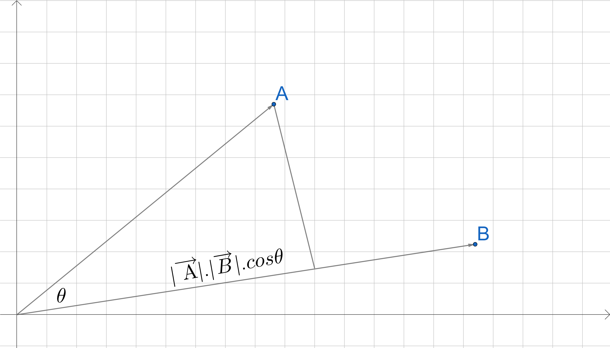

# 5.1.1 Vectors

1. Dot product
    1. [E] What’s the geometric interpretation of the dot product of two vectors?\
       [A] In the geometric context, the dot product of 2 vecotrs is projection of one vector over another.
        For the given geometric vectors $\overrightarrow A$ and $\overrightarrow B$, their dot product is given by\
           $$\overrightarrow A.\overrightarrow B = |\overrightarrow A|.|\overrightarrow B|.cos\theta$$ 
       
       
    2. [E] Given a vector $u$, find vector $v$ of unit length such that the dot product of $u$ and $v$ is maximum.\
       [A] Dot product of $\vec{u}$ and $\vec{v}$ is givenby $|\vec{u}|.|\vec{v}|.cos\theta$. Where $|\vec{u}|$ and $\vec{v}$ are the magnitude of the vectors respectively. This dot product will be maximum when $cos\theta$ will be maximum, which occurs when $\theta = 0$ i.e both the vector overlap with each other.\
       Since, $max |\vec{u}|.|\vec{v}|.cos\theta$\
       $= |\vec{u}|.|\vec{v}|.1$\
       $= |\vec{u}|.1$\
       The vector $v$ of unit length to yield max dot product with $u$ is given by 
       $\vec{u}.\vec{v}$ = $= |\vec{u}|$\
       $$\vec{v} = \frac{|\vec{u}|}{\vec{u}}$$
       
2. Outer product
    1. [E] Given two vectors $a = [3, 2, 1]$ and  $b = [-1, 0, 1]$. Calculate the outer product $a^Tb$?\
       [A] Given \
       $$a = [3, 2, 1],    b = [-1, 0, 1]$$\
       Their outer product is given as $a \times b$ which is also known as the 'cross product' given by $a^Tb$\
       $$a^Tb = 
       \begin{bmatrix}
       3 \\
       2 \\
       1
       \end{bmatrix} \times
       \begin{bmatrix}
       -1 & 0 & 1
       \end{bmatrix} = 
       \begin{bmatrix}
       -3 & 0 & 3 \\
       -2 & 0 & 2 \\
       -1 & 0 & 1
       \end{bmatrix}
       $$
       
    1. [M] Give an example of how the outer product can be useful in ML.\
       [A] Following are the use cases where the outer product of the vectors can be useful in ML.
       1. Measure orthogonality of 2 vectors: Two vectors are said to be orthogonal of the angle between them is $90\degree$ and the outer product among them is maximum.
       2. Correlation between 2 vectors
      
          
3. [E] What does it mean for two vectors to be linearly independent?\
   [A] Linearly independent vectors are orthogonal to each other. In such a situation, angel between the vectors will be $90\degree$. Which means their outer product will be zero.\
   $$\vec{u}\times\vec{v} = |\vec{u}|.|\vec{v}|.sin\theta = 0$$

   
5. [M] Given two sets of vectors $A = {a_1, a_2, a_3, ..., a_n}$ and $B = {b_1, b_2, b_3, ... , b_m}$. How do you check that they share the same basis?\
   [A] In order to check whether two sets of vectors share the same basis, we need to find out the number of independent vectors in their respective vector spaces and compare if they are equal. The set of independent vectors is given by the rank of their augmented matrices.

   $A = {a_1, a_2, a_3, ..., a_n}$ can be written as \
   $$A = 
   \begin{bmatrix}
       a_1 \\
       a_2 \\
       a_3 \\
       a_n
   \end{bmatrix}
   $$
   Rank can be found by iteratively performing linear transformation among the rows till we achieve non zero rows those will be the linearly independent rows of the matrix and will be equal to the rank of this matrix.
   
7. [M] Given $n$ vectors, each of $d$ dimensions. What is the dimension of their span?\
   [A] Dimension of the span of $n$ vectors is given by the rank of their augmented matrix.

   
9. Norms and metrics
	1. [E] What's a norm? What is $L_0, L_1, L_2, L_{norm}$?\
   [A]
        1. $L_0$ norm: Number of non zero elements in a vector.
        2. $L_1$ norm: Sum of absolute value of vector elements.\
           $|x|_1 = \sum{|x_i|}$
        4. $L_2$ norm: Length of vector in Euclidean space.\
           $||x||_2 = (\sum{x_i^2})^{\frac{1}{2}}$
        5. $L_{\infty}$ norm: Maximum absolute value of vector elemets.\
           $||x||_{\infty} = max{|x_i|}$
	1. [M] How do norm and metric differ? Given a norm, make a metric. Given a metric, can we make a norm?\
    [A]
